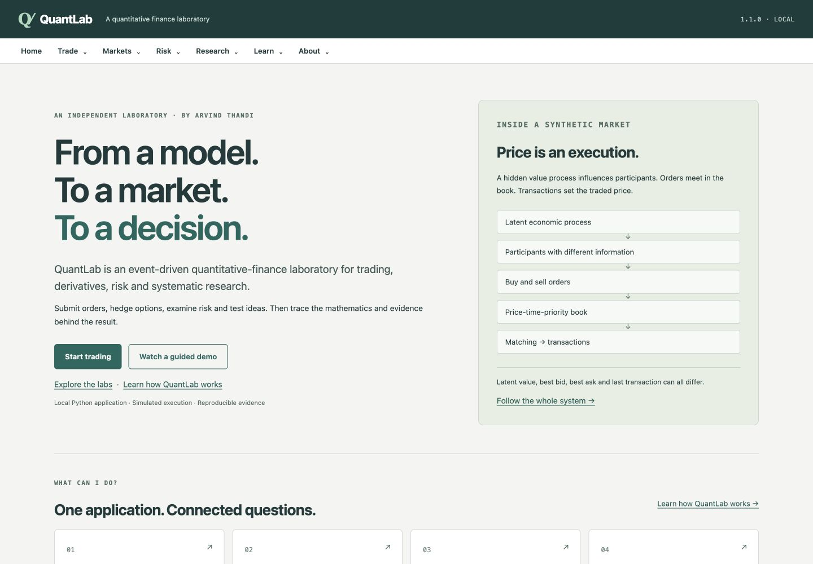
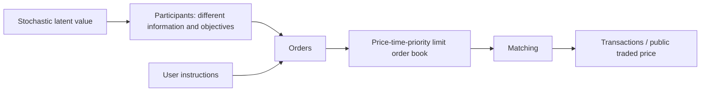
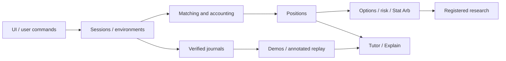

# QuantLab

**Event-Driven Quantitative Trading, Derivatives, Risk & Research Laboratory**  
**Arvind Thandi** · [MIT licensed](LICENSE) · Product 1.1.0

An independent, local quantitative-finance learning, simulation and research platform.
Submit orders, inspect their executions, price and hedge options, examine portfolio risk,
and test statistical ideas with reproducible evidence.



[Get running](#installation) · [Three-minute tour](docs/showcase/RECRUITER_WALKTHROUGH.md) ·
[Architecture](docs/architecture/OVERVIEW.md) · [Limitations](docs/LIMITATIONS.md)

## Why I built it

I built QuantLab to understand how quantitative-finance theory translates into observable trading,
risk and research decisions. A pricing formula is useful; seeing its inputs change, executing a
hedge, reconciling the account and challenging the result makes the idea concrete.

## 2-minute overview

Start the app and open its **Product tour** or **Guided Demos**. The recommended first lesson is
**How an order becomes a trade**. Pause, predict, reveal the engine result, then inspect its maths.

External video: **planned, not yet recorded**. The [shot plan](docs/showcase/VIDEO_PLAN.md) and
[narration draft](docs/showcase/HERO_NARRATION.md) are ready. No placeholder link pretends a video exists.

## What can you do?

| Area | What to inspect |
|---|---|
| Manual trading | Market/limit orders, price-time queues, partial fills, exact ledgers and public tape |
| Market making | Two-sided quotes, inventory-aware skew, fees, information asymmetry and markouts |
| Options | European pricing, Greeks, implied volatility, finite quotes and stock hedging |
| Portfolio risk | Covariance, VaR/ES, full repricing, stresses, limits and constrained optimisation |
| Stat Arb | Past-only regression, residuals, z-scores, sequential legs and relationship failure |
| Research | Monte Carlo, paired comparisons, uncertainty, bootstrap and untouched evaluation |
| Learn & Explain | Actual-input explanations, concept journeys, predictions and verified-session teaching |
| Markets | Synthetic agents, provenance-aware historical paper replay and known/hidden scenarios |

## Trading Simulator

The user submits **BUY / SELL**, **MARKET / LIMIT**, **SIZE**, **PRICE**, and **CANCEL** instructions.
They pass through the Python matching engine. Better prices execute first; orders at the same price
retain FIFO priority. Market orders may walk several levels or leave an unfilled remainder.
A limit order can wait, partially fill or never trade.

Inspect aggregated depth, individual queues, per-order VWAP, fees, cash, signed positions, realised
and unrealised P&L. A positive position is long; a negative position is short. Marked P&L depends on
the stated public reference and is not a guaranteed liquidation value.

## How does the synthetic market work?

A latent economic process influences a market containing participants with different information
and objectives. Their orders interact in the book. **Transaction prices emerge from matching**;
they are not simply the output of a Brownian-motion price generator.



Latent value, best bid, best ask and last transaction can differ. Ordinary agents do not receive
latent value. The informed trader receives a noisy signal; permitted post-session observer review
can reveal the private evidence. Public explanations and prediction checkpoints cannot use it.

## Market environments

| Environment | What is real? | What is simulated? | What QuantLab knows | Execution |
|---|---|---|---|---|
| Synthetic | No real market observations | Value process, participants, orders and fills | Configured mechanisms; private value is hidden from ordinary agents | Actual fills from the simulated FIFO order book |
| Historical replay | Imported recorded OHLCV; bundled fixture is artificial | Your orders, fills and P&L | Revealed observations and supplied provenance; no hidden cause | Paper execution at later closes, under participation, slippage and fee assumptions |
| Scenario | No real market observations | A controlled synthetic regime and executions | Configured mechanism; hidden scenarios require an explicit ended-session reveal | Existing simulated execution model for the scenario's lab |

**No real historical dataset is bundled.** The supplied OHLCV fixture is artificial test data.
Recorded history does not disclose the true cause of a price movement, nor prove where your order
would have filled. [Environment contract](docs/markets/ENVIRONMENTS.md) ·
[Historical execution assumptions](docs/markets/HISTORICAL_EXECUTION.md).

## Market Microstructure / Market Making

Compare fixed and inventory-aware quote policies. Observe informed decisions, resting-price
execution and provider-signed markouts. Spread capture can be outweighed by fees, inventory moves
and adverse selection. A negative markout alone does not identify an informed counterparty.
These agents are controlled teaching models, not calibrated venue participants.

## Options & Derivatives

Black–Scholes–Merton links European values to delta, gamma, vega, theta and rho. The IV solver
checks feasibility and uses safeguarded Newton steps with a bisection fallback. Independent
finite differences and risk-neutral Monte Carlo validate numerical properties under the model.

Trade finite synthetic option quotes and hedge through actual simulated stock executions. Contract
multipliers, fees, financing and settlement remain explicit. Delta-neutral does not mean risk-free.
[Options mathematics](docs/maths/phase_08_options.md).

## Portfolio Risk

Read actual stock/options ledgers, position sensitivities and stated covariance. Compare delta-normal,
empirical and Monte Carlo VaR/Expected Shortfall; inspect stress full repricing versus Greek
approximation. Explore covariance decomposition, correlation stress, constraints and allocation.
The assumptions govern the result; this is not a regulatory risk platform.
[Risk mathematics](docs/maths/phase_09_portfolio_risk.md).

## Statistical Arbitrage

Fit regression using past observations, calculate residual spreads and normalise using prior
rolling statistics. Trace model vintages, walk-forward tests, sequential leg executions and
relationship breakdown. Study correlation versus cointegration intuition, spurious relationships,
look-ahead bias and pair mining. A z-score is not a promise of convergence.
[Stat Arb mathematics](docs/maths/phase_10_statistical_arbitrage.md).

## Research Engine

Register questions and variants, use deterministic root/pool/run seeds and keep losing and failed
runs. Common random numbers pair comparable exogenous paths. Reports include distributions,
confidence intervals, bootstrap estimates and paired comparisons. Development, locking and
untouched evaluation are separate steps; reusing evaluation is recorded rather than disguised.
An apparently profitable synthetic backtest does not establish real-world alpha.
[Research design](docs/architecture/phase_05_design.md).

## Explainability

Open the small **?** beside a value or **Explain this moment** in a demo:

- **What is this?** A definition tied to the displayed quantity.
- **Why did this change?** Recorded before/after inputs and supported contributors.
- **What affects it? / What does it affect?** The central concept graph.
- **Show me the maths / an example.** Equations, units and isolated existing-engine examples.
- **Where is it used?** Professional context and the differences from production.

Beginner, Maths, Quant and Interview alter depth, not calculations. Definitions come from one
registry. Public state, historical observations and synthetic observer facts retain distinct labels.
[Explain user guide](docs/explainability/USER_GUIDE.md).

## Quant Tutor

The local tutor uses explicit questions, validators, prerequisites, hint rules and answer evidence.
It does not use an external language service or claim to infer understanding from reading.
Viewing/completing a demo, showcase playback, P&L and replay practice are separate from mastery.
Interview and project-defence modes support rehearsal, not an automatic assessment of speaking skill.

## Guided Demos

58 topic entries across eight domains reuse genuine engine episodes. Eight flagships:

1. How an order becomes a trade
2. Getting picked off
3. Delta hedging
4. VaR vs ES
5. Correlation vs cointegration
6. Winner’s curse / multiple testing
7. How synthetic prices emerge
8. Historical replay: what is real?

Choose Quick, Learn, Quant or Interview. Restart deterministic evidence, try genuine hedge branches,
or load an ended journal for **Teach Me This Session**. Before/action/result disclosure prevents
future outcomes from leaking into prospective explanations. Hindsight is explicit. Process quality
is left unknown when the evidence is insufficient; profitable outcomes receive no automatic praise.
[Flagships and named captures](docs/demos/FLAGSHIP_DEMOS.md).

## Example: one order through QuantLab

The predetermined order demo submits **BUY 10 MARKET** into asks of 3 at £100.01, 4 at £100.02,
and 8 at £100.04. The engine records:

| Fill quantity | Execution price |
|---:|---:|
| 3 | £100.01 |
| 4 | £100.02 |
| 3 | £100.04 |

VWAP = `(3 × 100.01 + 4 × 100.02 + 3 × 100.04) / 10` = **£100.023**.
Fees are **£0.01**, cash becomes **£8,999.76**, and position is **+10 units**. Five units remain
at the last ask. At the resulting public mark £100.015, marked P&L is **−£0.09**.
These are [verified engine outputs](docs/demos/scripts/order.md), not illustrative invented fills.

## Example: delta hedging

One call with multiplier 100 has aggregate delta **51.14357531 stock units**. A full whole-unit hedge
sells **51**, leaving **0.14357531**. The seeded next spot is **£99.73** and net delta becomes
**−1.78994554**: gamma changes the required hedge. Rehedging buys **2** units. A volatility shock
still affects the position. [Actual path and assumptions](docs/demos/scripts/delta-hedge.md).

## Example: VaR vs ES

The controlled loss distributions both have **95% VaR = 10**, while ES is **12 versus 48**.
The threshold is equal; average severity in the worst 5% is not. There are 100 observations and
five effective tail observations. [Calculation and tail convention](docs/demos/scripts/tails.md).

## Example: winner’s curse

Fifty genuinely equal, zero-mean Gaussian controls produce different development outcomes.
The predetermined seed selects **variant-32**: development mean **0.277506**, untouched evaluation
mean **0.047892**. Evaluation is less impressive but still positive. The demo retains that correct
result, all candidates and the selection lock. These are abstract sampled scores, not trading
returns. [Verified selection evidence](docs/demos/scripts/winner.md).

## Architecture

Python owns financial calculations and state. Small HTTP adapters serve the same application;
HTML/CSS/JavaScript render values, charts and controls. Presentation does not decide fills or risks.



[System overview](docs/architecture/OVERVIEW.md) · [Technical reviewer route](docs/showcase/TECHNICAL_WALKTHROUGH.md).

## Correctness / Testing

1,933 tests pass in both the working environment and a fresh local clone. Tests cover matching conservation, exact
cash/position reconciliation, numerical properties, future-data mutation, information boundaries,
determinism, verified replay and product routes. All **1,910** approved pre-release tests remain.
The financial core and representative engine-result fingerprints are unchanged.

Test count is coverage evidence, not proof of a realistic market or profitable strategy.
[Final verification report](docs/release/PHASE15_REPORT.md).

## Reproducibility

Deterministic streams, configuration, commands, journals, experiment records and strict version
checks make results inspectable. **Product/package 1.1.0 retains financial replay core 1.0.0** so
approved journals keep their original interpretation. Runtime/library constraints still apply.
Do not edit old journal metadata to force replay. [Version decision](docs/release/VERSIONING.md).

## Installation

Clone the [public repository](https://github.com/arvindthandi36/quantlab), then install and launch
on macOS/Linux:

```bash
git clone https://github.com/arvindthandi36/quantlab
cd quantlab
python3 -m venv .venv
. .venv/bin/activate
python -m pip install .
quantlab serve
```

Open **http://127.0.0.1:8765/home**. One process serves every area. The default is loopback only;
no broker, API key, Node installation or external service is required. Stop with Ctrl+C.
On Windows, use `py -m venv .venv` and `.venv\Scripts\Activate.ps1` in PowerShell before the
same install/serve commands. Windows has not been verified in this release gate.

For development and the exact tested dependency constraints:

```bash
python -m pip install -c requirements-dev.lock -c requirements-research.lock '.[dev]'
python -m pytest -q
ruff check src tests scripts
quantlab --version
```

Python 3.11+ is declared; the clean-install gate uses Python 3.14.0 on macOS. Other combinations
are not certified by that run. NumPy, SciPy and Matplotlib are installed for the unified labs.
The constraints are a tested platform snapshot, not a universal hashed lockfile.
[Fresh source-clone/install evidence](docs/release/phase_15/clean_install.json).

## Quick start

1. **Home → Start trading** opens the existing paused desk at `/`. Prepare Buy/Sell, quantity,
   Market/Limit and price if needed; submit, then inspect My orders and My executions.
2. **Home → Watch a guided demo** opens the deterministic order lesson. Reveal only after predicting.
3. **Trade → Options** opens quotes, Greeks and hedge controls. **Risk** reads the linked ledgers.
4. **Trade → Stat Arb** uses its own named-asset session. **Research** links the registered studies.
5. **Markets → Choose environment** offers Synthetic, Historical and Scenario. End before switching.
6. **Learn → Concept explorer / Guided Demos / Learning progress** offers explanation and practice.

Session and learning files live under ignored `runs/` relative to the launch directory. Use one
server per working directory; export ended journals and retain historical source data before closing.
`quantlab serve --port 8772` selects another port. No browser is opened automatically.

## Model assumptions and limitations

Read [the organised limitations page](docs/LIMITATIONS.md), also available in-app under About.
It covers uncalibrated agents, synthetic liquidity, historical paper fills, Black–Scholes,
covariance and tail assumptions, unstable statistical relationships, research selection and local security.
[Canonical units and signs](docs/conventions.md) remain unchanged.

## What QuantLab does NOT claim

- Production exchange or execution infrastructure.
- Investment advice or evidence of real-world alpha.
- Actual historical fills from bar data.
- Regulatory risk software or formally certified accessibility/security.

## Project structure

```text
src/quantlab/
  orderbook/ market/ portfolio/    Matching, agents, clocks and ledgers
  trading/ options/ risk/ statarb/  Sessions, calculations and local UI
  research/                        Registered experiments and statistics
  environments/                    Synthetic, historical and scenario coordination
  tutor/ explainability/ demos/    Teaching, public projections and verified replay
  product/                         Product shell, overview copy and release launcher
tests/                             Mathematical, statistical, integration and product checks
docs/                              Architecture, maths, assumptions and retained audit evidence
scripts/                           Reproducible evidence and release checks
```

## Documentation

- [Recruiter walkthrough](docs/showcase/RECRUITER_WALKTHROUGH.md)
- [Technical walkthrough](docs/showcase/TECHNICAL_WALKTHROUGH.md)
- [Project defence](docs/showcase/PROJECT_DEFENCE.md)
- [Architecture](docs/architecture/OVERVIEW.md), [units](docs/conventions.md), [assumptions](ASSUMPTIONS.md)
- [Screenshot catalogue](docs/showcase/CAPTURE_PLAN.md), [video plan](docs/showcase/VIDEO_PLAN.md)
- [Replay contract](docs/release/replay_policy.md), [release asset policy](docs/release/ASSET_POLICY.md)
- [Contributing](CONTRIBUTING.md), [local security scope](SECURITY.md)

## Roadmap / Status

**1.1.0: planned product features frozen.** Future work defaults to bug fixes, documentation,
compatibility and test improvements. Optional research directions are not release commitments.
[Feature freeze](FEATURE_FREEZE.md) · [Changelog](CHANGELOG.md) · [Release report](docs/release/PHASE15_REPORT.md).
Source is public at [arvindthandi36/quantlab](https://github.com/arvindthandi36/quantlab).
Release tagging and external recording remain separate actions.

## Author

**Arvind Thandi**. [MIT License](LICENSE), copyright 2026 Arvind Thandi.
