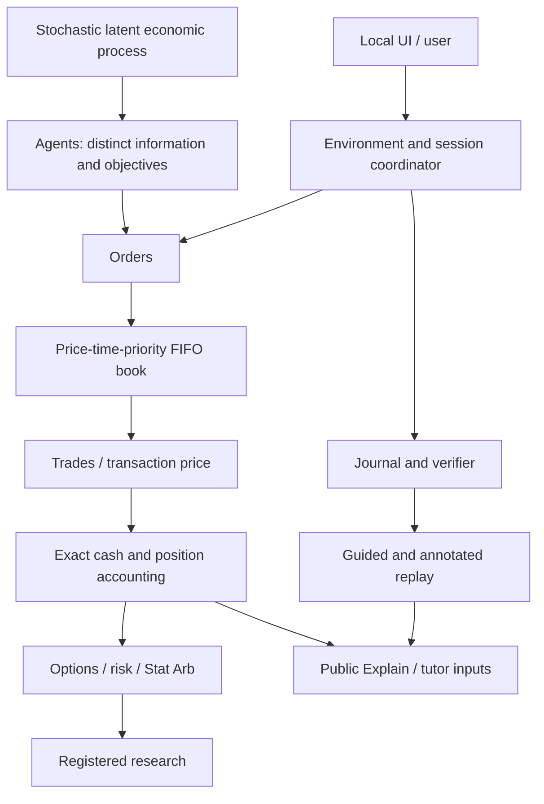

# QuantLab system overview

Product 1.1.0 presents the validated financial replay core 1.0.0. It adds no new financial rule.

Latent value influences synthetic participants. It does not set the price of each trade. Best bid,
best ask, last transaction and latent value can differ. Ordinary agents receive public observations;
informed agents receive noisy signals, and private observer evidence has separate reveal rules.

Historical inputs replace the source of observed prices, not the need for an execution model.
OHLCV cannot establish queue truth. Known/hidden scenarios apply existing engine configurations.

## Responsibilities and source entry points

| Component | Entry point | Boundary |
|---|---|---|
| Domain and exchange | `domain.py`, `orderbook/book.py`, `orderbook/conservation.py` | Tick/quantity validation, FIFO, per-match conservation |
| Market | `market/simulation.py`, `agents/` | Event queue, separate random streams and private/public information |
| Accounting | `portfolio/accounting.py`, `trading/session.py` | Exact fills, fees, reservations, cash/position/P&L identities |
| Derivatives | `options/pricing.py`, `options/session.py` | European model values, contracts and executed stock hedges |
| Portfolio risk | `risk/analytics.py`, `risk/session.py` | Reads actual positions; covariance/stress remain assumptions |
| Stat Arb | `statarb/statistics.py`, `statarb/session.py` | Past-only fitting and sequential leg execution |
| Research | `research/engine.py`, `research/statistics.py` | Registration, development/lock/evaluation and recorded failures |
| Environments | `environments/application.py` | One selected evidence source and compatible observations |
| Teaching | `tutor/`, `explainability/`, `demos/` | No market RNG draws; no automatic profit-based mastery |
| Product | `product/`, `trading/navigation.py` | Static overview, common shell and additive release launcher |
| HTTP | `trading/server.py` | Loopback, existing Host/token controls, shared locks |

Source paths are relative to `src/quantlab/`. Exact [reviewer links](../showcase/TECHNICAL_WALKTHROUGH.md).

## Options path

Underlying → pricing / finite quotes → contracts → multiplier-aware Greeks → stock-book hedge → risk.
Whole-unit hedges leave residual delta; gamma, vega and costs remain.

## Stat Arb path

Revealed multi-asset observations → past-only regression → residual → past-only z-score → rule →
sequential legs → risk → registered out-of-sample research. Stable synthetic residuals do not
establish real-market cointegration.

## Presentation and replay

The browser renders server values and chart coordinates. Product navigation does not submit orders.
Demo deep links call the existing isolated demo API. Built-in demos prepare bounded genuine runs
server-side and reveal them checkpoint by checkpoint. They are guided evidence playback, not a
second live account. Named captures are explicit showcase states and cannot award learning credit.

One local server owns one demonstration presentation state. Financial replay checks keep the
approved core version; package versioning is [documented separately](../release/VERSIONING.md).
See [information boundaries](../demos/INFORMATION_BOUNDARIES.md),
[limitations](../LIMITATIONS.md), and [conventions](../conventions.md).
