# QuantLab · real release captures

These are direct screenshots of the running application. No generated mockups or pixel edits.
The QA learning profile has no graded answers. All execution shown is simulated.

[Capture procedure](../../showcase/CAPTURE_PLAN.md) · [Dimensions, states and hashes](captures.json)

## Home

Static overview. Route: `/home`.

## Home Mobile

Phone 390 × 844. Route: `/home`.

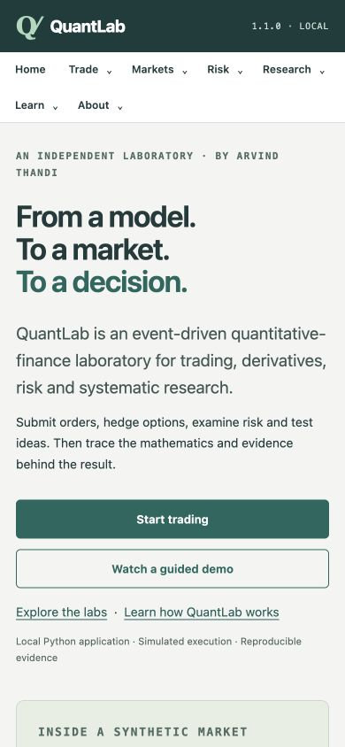

## Trading Desk

Seed 42; paused; BUY 6 MARKET; position 6. Route: `/`.

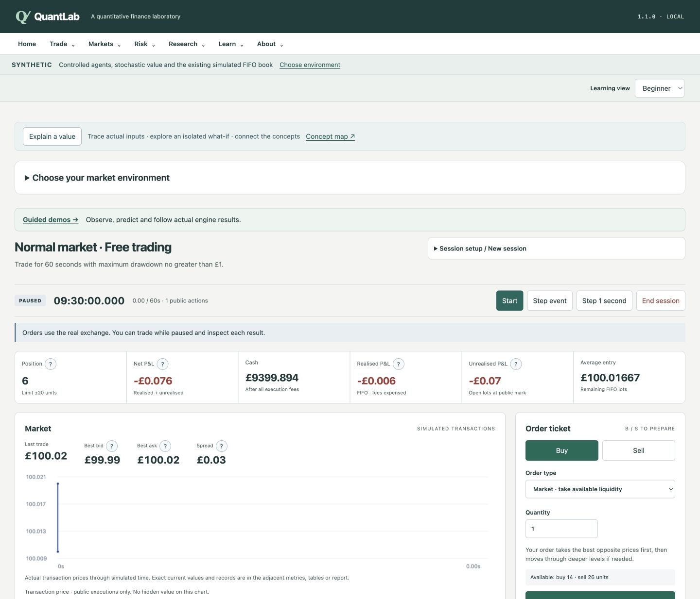

## Order Vwap

order-after-multifill; Quick showcase; Recording mode. Route: `/demos`.

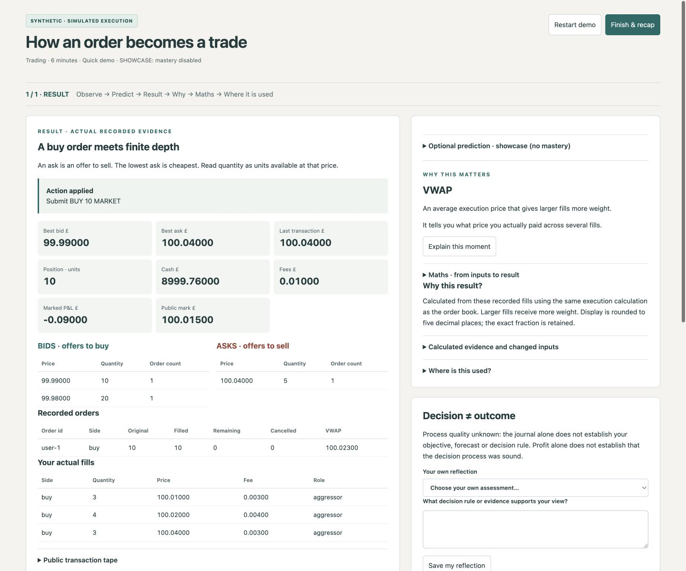

## Synthetic Prices

synthetic-after-event; public evidence only. Route: `/demos`.

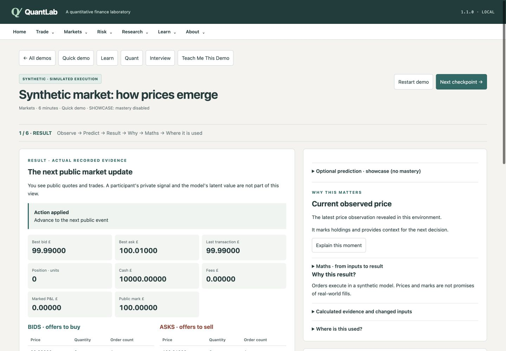

## Options Lab

Fresh default day-0 chain; no option position. Route: `/options`.

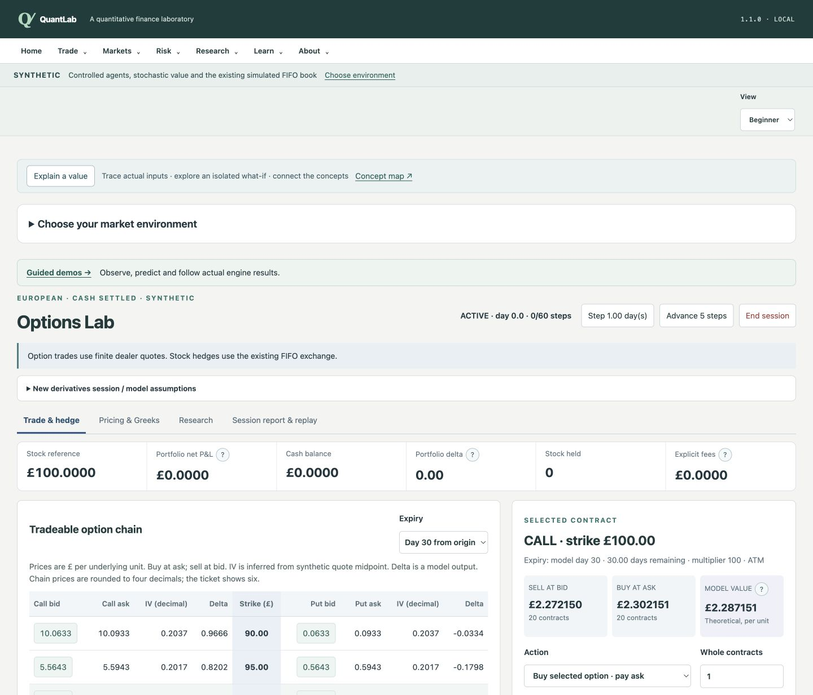

## Delta Hedge

delta-after-hedge; full branch; stock -51. Route: `/demos`.

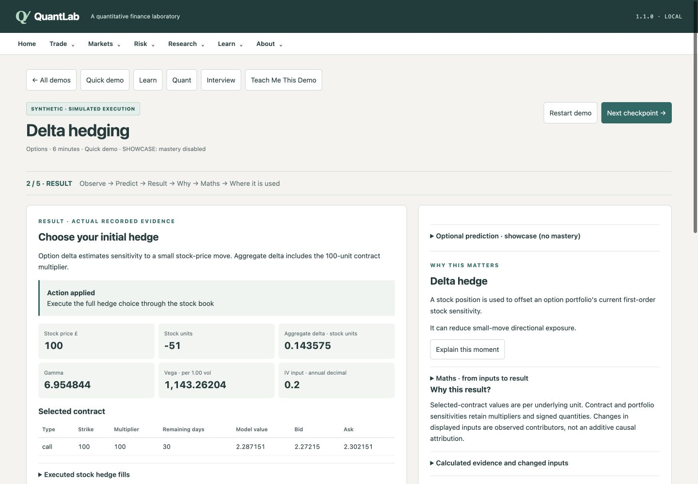

## Risk Lab

var-vs-es-tail; actual calculation. Route: `/demos`.

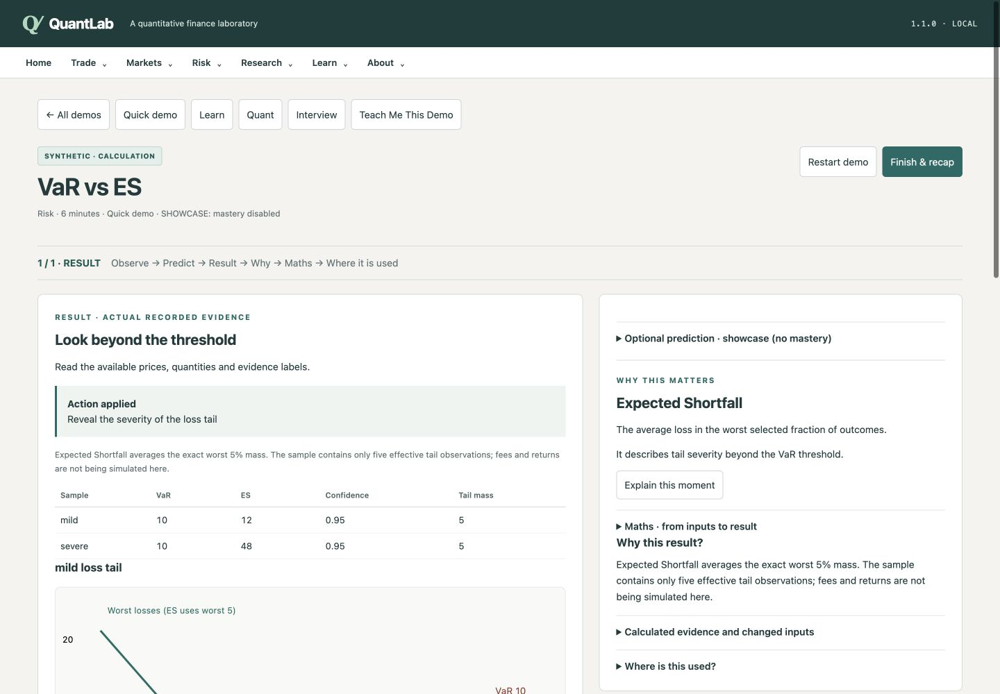

## Stress Test

Six-unit stock position; default custom stress full repriced. Route: `/risk#stress`.

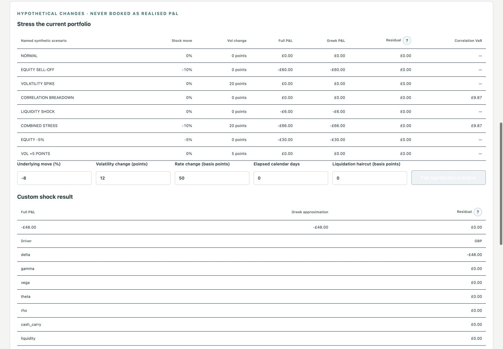

## Statarb Lab

Default seed; 120 observed rows; past-only fit. Route: `/statarb#model`.

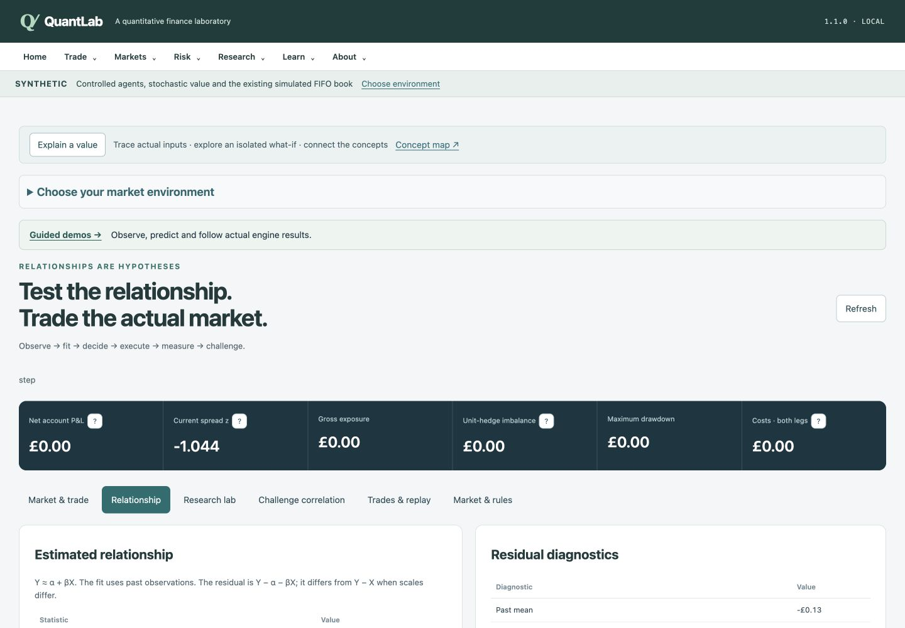

## Correlation Residual

correlation-vs-residual; actual controlled paths. Route: `/demos`.

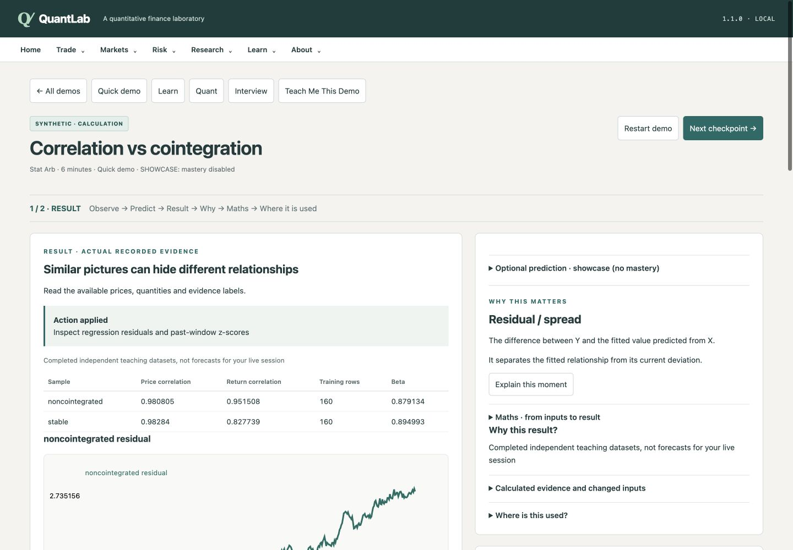

## Research Distribution

winner-before-test; 50 development scores. Route: `/demos`.

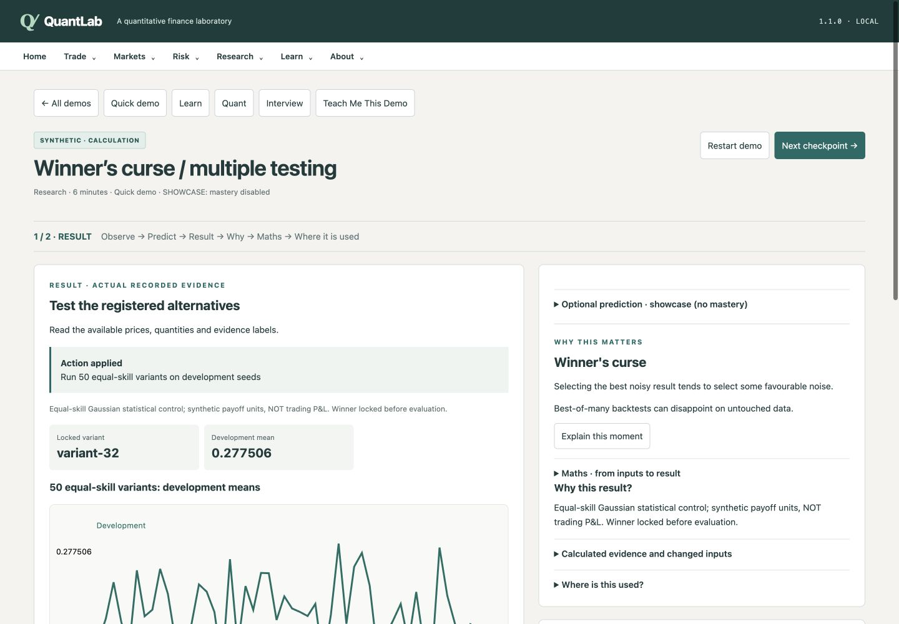

## Explain Mode

order-after-multifill → Explain VWAP; selected demo context. Route: `/demos`.

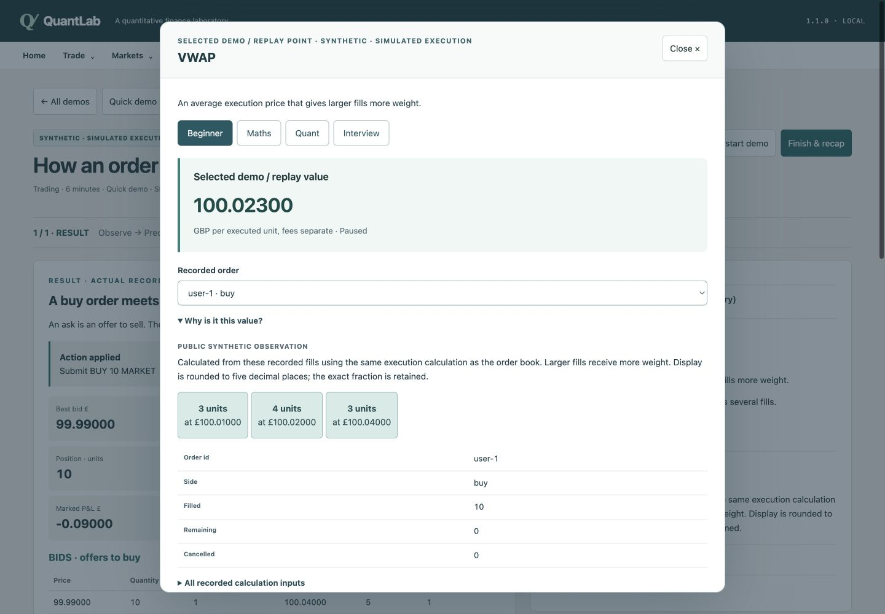

## Guided Demo

order-before-submit; public input checkpoint. Route: `/demos`.

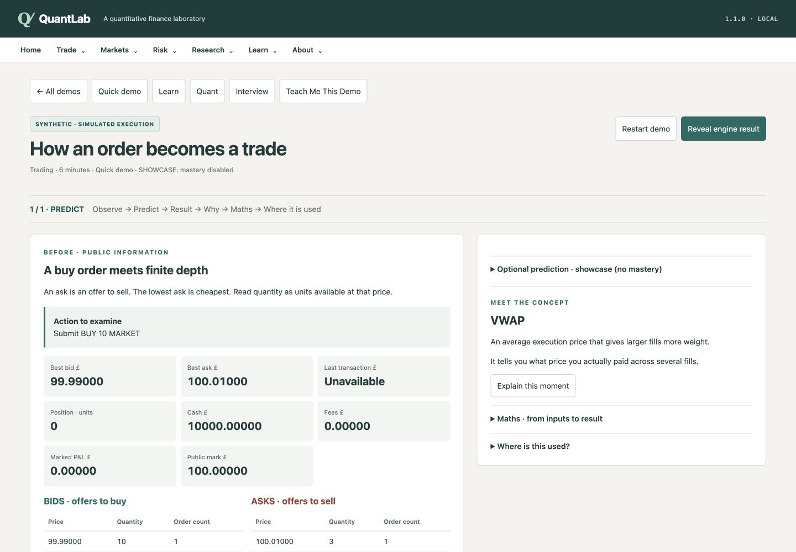

## Learning Dashboard

Temporary QA profile; zero graded answers. Route: `/learning`.

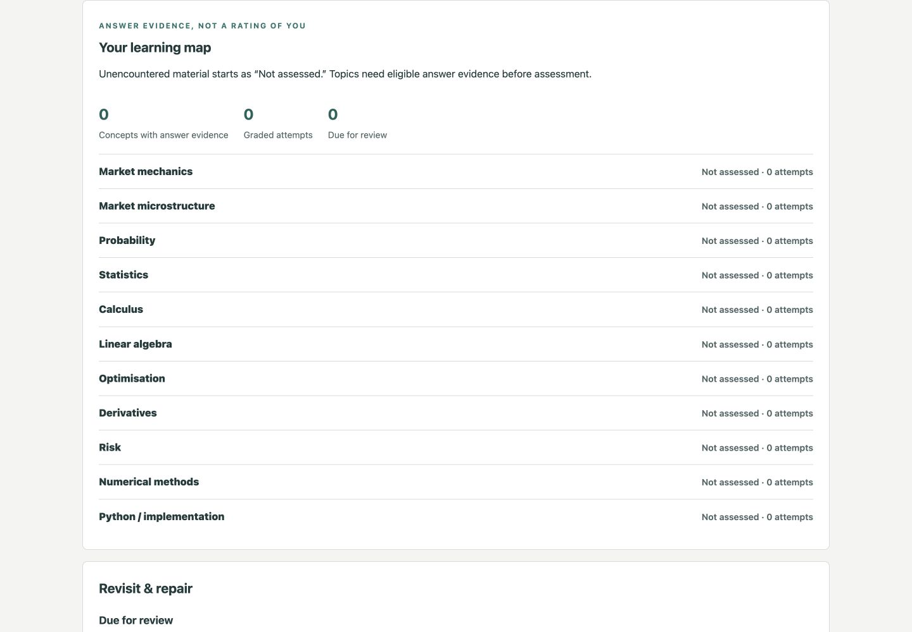
