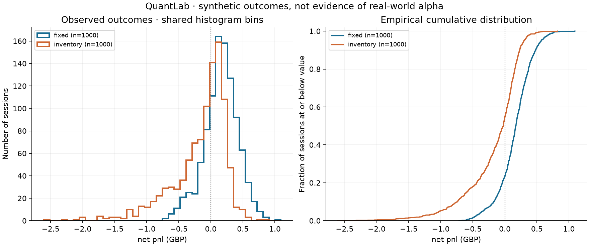
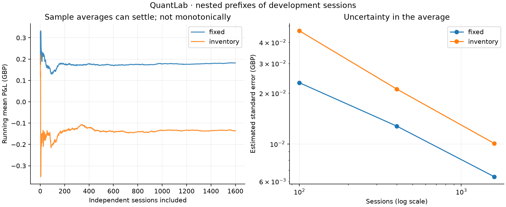
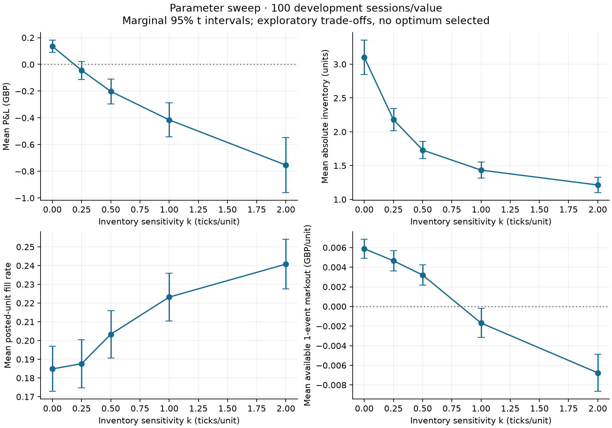
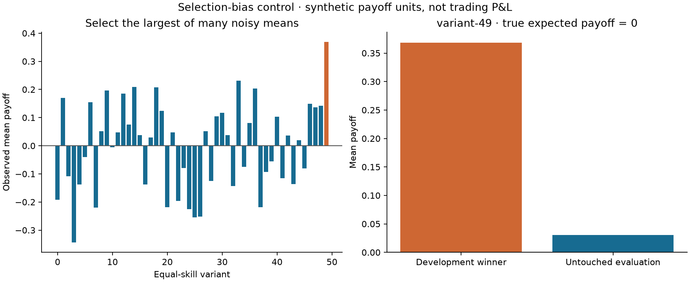

# Phase 5 review — Monte Carlo and quantitative research

> Historical phase record. Current core conventions and release status are in the root README, ASSUMPTIONS and Phase 11 release report. Test counts and runtime labels below describe this phase.


Arvind Thandi · QuantLab 0.5.0 · verified 11 September 2026.

**Phase 5 is complete. All 486 tests pass. Phase 6 has not started.**

QuantLab is a synthetic quantitative research environment. Synthetic performance
is not evidence of real-world alpha. The larger study preserves the uncomfortable
Phase 4 result: the inventory-aware rule carries less inventory but earns less
under the current model and public marking convention.

## BUILD REPORT

The workflow is hypothesis → design → repeated independent sessions → distributions
→ statistical analysis → interpretation → limitations. A reusable adapter protocol
separates the research engine from the trading model. The generic engine contains
no market-maker, order-book, instrument or portfolio dependency. Market making is
the first trading adapter; a Gaussian equal-skill control exercises the same engine
without a market. Later directional, options and portfolio strategies can provide
the same interface and use the existing exchange infrastructure.

Implemented: deterministic root/pool/index seeds, independent random streams,
verified exogenous pairing, immutable prior registrations, complete run records,
failure retention, t intervals/tests, percentile bootstrap, all metric distributions,
tail thresholds, correlations, reusable one-dimensional sweeps, evaluation-access
warnings, histograms/ECDFs, teaching controls, lightweight batches and exact extreme
regeneration/full replay. The [research contract](../architecture/phase_05_design.md)
was recorded before the market experiments. No parameters were tuned to win.

Research dependencies are optional NumPy/SciPy/Matplotlib. The matching/market
core remains dependency-free. No notebook, parallel worker framework, funding model,
new market agent or Phase 6 manual trading application was introduced.

## TEST REPORT

**486 passed, 0 failed, 0 skipped. All 372 prior cases remain, with 114 additions.**
The final complete suite ran in 6.91 seconds on the verified host. Lint and
format checks pass; dependency consistency passes.

| Added file | Cases | Principal coverage |
| --- | ---: | --- |
| `tests/unit/test_research_statistics.py` | 36 | Hand-calculated moments/quantiles, t intervals, paired differences/test, bootstrap units/reproducibility, tails, missing/degenerate data and correlation |
| `tests/unit/test_research_design.py` | 23 | Stable unique seed prefixes, disjoint pools, independent streams, strict JSON, hypotheses, evaluation warnings, generic sweeps and validated outcomes |
| `tests/unit/test_research_maker_reporting.py` | 2 | Quantity-weighted pooled markouts and missing/pending coverage |
| `tests/integration/test_research_batch.py` | 16 | Full/batch identity against independent offline diagnostics, event budgets, privacy, extra signal draws, common weather and exact fees |
| `tests/integration/test_research_engine.py` | 16 | Registrations before execution, immutable results, failures/survivor bias, unfair comparisons, tampering, thousand-session support, sweeps and extreme replay |
| `tests/integration/test_research_cli.py` | 16 | Discoverability, required predictions, hint/retry order, interruption, plots, ECDF ties, prefixes, selection, significance and replay commands |
| `tests/statistical/test_research_inference.py` | 5 | Moments/correlation, empirical t-interval coverage, bootstrap SE, square-root scaling and repeated selection optimism |

There are now 15 statistical cases overall. The previous Hypothesis test still
runs 200 generated mixed-operation examples, counted as one pytest case. Statistical
checks use sensible tolerances, not exact fortunate random outcomes. Small engine
experiments reproduce their complete outcome digests and bootstrap analysis; full
batch-mode and replay equivalence is separately checked. All six selected extreme
cases below were regenerated and verified through the original journal replay.

Verified environment: Python 3.14.0/macOS, NumPy 2.5.3, SciPy 1.18.1,
Matplotlib 3.11.1, pytest 9.1.1, Hypothesis 6.168.0, Ruff 0.16.6. Other supported
Python/platform combinations are not verified. Dependency snapshots are not
cross-platform, hash-verified locks.

## MONTE CARLO ENGINE EXPLANATION

A session starts a fresh market and runs to its declared horizon. Repeating that
session with different seeds samples different possible histories of the same
model. The resulting outcome distribution tells us much more than one demo.

The root seed is 20260911. Session addresses combine it with development/evaluation
pool and zero-based run index. Both policies at an address share the same seed.
Every run keeps its outcome, coverage, seed and fingerprints; the registered
variant supplies its complete market/strategy configuration and duration. Versions
and timestamps are saved. Reproduction compares outcomes independently of runtime
and timestamps. A failed simulation is retained and disables inference from survivors.

Named random streams isolate latent shocks, noise/liquidity/informed arrivals,
normal trader decisions and informed signals. An extra draw in one stream does
not advance another. It may still change later market behaviour through the orders
that result: independence of random sources does not mean economic independence.

Common random numbers mean **testing two strategies under the same weather**.
The weather is exogenous arrivals/shocks/signal errors. Quotes, fills and later
public book states are endogenous consequences. The engine verifies the former
matches without demanding the latter match. One whole pair is the inference unit.

## ONE 1,000-RUN EXPERIMENT

The final baseline contains **1,000 fresh evaluation sessions per policy: 1,000
pairs, 2,000 complete market sessions**, each lasting 30 simulated seconds.
Defaults remain two-tick half-spreads, size two, k=0.5 ticks/unit, soft/hard limits
4/8, one-second refresh and 0.1 tick/unit fees. Informed arrivals remain 1/second.

Before that final evaluation: 1,600 development pairs and five k values with
100 development sessions each. Total principal market experiments: **5,700 sessions**.
No failed session was excluded: all completed. The main sample sizes, hypotheses,
loss thresholds and baseline settings were declared before results.

Evidence: [evaluation registration](phase_05/evaluation/registration.json),
[complete evaluation record](phase_05/evaluation/experiment.json),
[every attempted evaluation row](phase_05/evaluation/runs.jsonl),
[full distribution summary](phase_05/evaluation/summary.md).
The [development record](phase_05/development/experiment.json) retains all 1,600
pairs. Its first 1,000 sessions average £0.177156 fixed and −£0.135134 inventory-aware;
these are overlapping development prefixes, not extra independent experiments.

## FIXED VS INVENTORY-AWARE RESULTS

All following main results refer to the **fresh evaluation pool**.

| Net P&L distribution | Fixed | Inventory-aware |
| --- | ---: | ---: |
| Mean | £0.15851 | −£0.16121 |
| Median | £0.17000 | −£0.02600 |
| SD | £0.26386 | £0.43023 |
| 5th percentile | −£0.34605 | −£1.02405 |
| 25th percentile | £0.01375 | −£0.33675 |
| 75th percentile | £0.32900 | £0.12600 |
| 95th percentile | £0.56905 | £0.29910 |
| Worst | −£0.71600 | −£2.60600 |
| Probability of loss | 23.2% | 54.1% |
| Probability below −£0.25 | 7.2% | 30.6% |
| Probability below −£0.50 | 1.4% | 18.0% |
| Probability below −£1.00 | 0.0% observed | 5.2% |
| Mean of worst 50 outcomes | −£0.46770 | −£1.38482 |

Zero observed breaches is not zero population risk.

| Other diagnostics | Fixed | Inventory-aware |
| --- | ---: | ---: |
| Mean net realised P&L | £0.168675 | −£0.136745 |
| Mean maximum drawdown | £0.274713 | £0.438723 |
| 95th-percentile maximum drawdown | £0.584150 | £1.266600 |
| Mean time-average absolute inventory | 3.09813 units | 1.79332 units |
| Mean maximum absolute inventory | 5.839 units | 4.793 units |
| Mean turnover | £2,041.55264 | £2,504.77480 |
| Mean posted-unit fill rate | 18.929% | 21.324% |
| Mean execution-edge proxy | £0.388130 | £0.436255 |
| Mean inventory/reference movement | −£0.209205 | −£0.572420 |
| Mean fees | £0.020415 | £0.025045 |
| Mean available session 1-event markout | £0.005861/unit | £0.002184/unit |
| Mean available session 5-event markout | £0.007087/unit | £0.000906/unit |
| Mean available session 20-event markout | £0.007478/unit | −£0.005677/unit |

The full summary reports the requested mean/median/SD/5/25/75/95th percentiles
for **every metric**, not just P&L. Mean net P&L reconciles to mean execution edge
plus inventory/reference movement minus fees. Markouts remain non-additive diagnostics.

The exposure-reduction part of the prior hypothesis is supported in this model.
The inventory-aware policy's P&L advantage is negative here. Lower exposure did
not imply smaller monetary losses: execution prices and reference movements matter.
The larger execution-edge proxy did not overcome its inventory/reference loss.

Available session counts for fixed markouts are 999/1,000, 1,000/1,000 and
999/1,000 at horizons 1/5/20; inventory-aware has at least one available unit in
every session at all three horizons. This does not mean every fill has a mark:
at h=1 fixed has 14,047 available units, 6,349 missing and 19 pending;
inventory-aware has 19,295 available, 5,736 missing and 14 pending.
[All unit coverage and pooled markouts](phase_05/evaluation/markout_coverage.json).
Means of session means and pooled unit means are explicitly different estimands.

## PAIRED-DIFFERENCE EXPLANATION

D = inventory-aware P&L − fixed P&L, calculated inside each shared-weather pair.

| Paired statistic | Evaluation result |
| --- | ---: |
| Mean D | −£0.31972 |
| Median D | −£0.22200 |
| SD(D) | £0.38036 |
| SE(mean D) | £0.01203 |
| 95% Student interval | [−£0.34332, −£0.29612] |
| 95% percentile bootstrap interval | [−£0.34344, −£0.29646] |
| Inventory-aware wins / loses / ties | 14.9% / 84.9% / 0.2% |
| t statistic, 999 degrees of freedom | −26.5811 |
| Two-sided p-value | 3.62 × 10⁻¹¹⁸ |
| Standardised paired effect | −0.84057 |

Shared-weather P&Ls have sample correlation 0.485 and covariance 0.0550 GBP².
Their positive covariance reduces variance of the difference. An unpaired
calculation would ignore that useful matching. Pairing need not help when the
shared outcomes have little or negative covariance.

The null is E[D]=0; the alternative is E[D]≠0. The tiny p-value is evidence against
that null under the test/model assumptions. It does **not** establish a profitable
real-world strategy. The effect is also larger than the predeclared illustrative
£0.05/session practical threshold, in the unfavourable direction for inventory-aware.

## DISTRIBUTION EXPLANATION



The histogram counts sessions in common price bins. The empirical CDF shows the
fraction at or below each result. The inventory-aware left tail extends much
further into losses, despite its smaller position exposure. Its median is closer
to zero than its mean because severe negative outcomes pull the mean downward.
Neither histogram is assumed to be normal. Mean confidence intervals concern
uncertainty of the average, not a range covering 95% of individual sessions.

## STANDARD DEVIATION VS STANDARD ERROR

The optional 100→400 prediction was asked before showing these results; no user
answer is recorded. **SD is variation between sessions. SE is uncertainty in the
estimated average.** SE=s/sqrt(n), so quadrupling n roughly halves SE.

| Development prefix | Fixed mean | Fixed SD | Fixed SE | Inventory-aware SD | Inventory-aware SE |
| --- | ---: | ---: | ---: | ---: | ---: |
| 100 | £0.13471 | £0.23052 | £0.02305 | £0.46807 | £0.04681 |
| 400 | £0.17799 | £0.25487 | £0.01274 | £0.42227 | £0.02111 |
| 1,600 | £0.18237 | £0.25553 | £0.00639 | £0.40260 | £0.01006 |

From 400 to 1,600, fixed SE almost exactly halves while SD is almost unchanged.
From 100 to 400 it decreases less precisely because the sample SD also changes.
These are nested prefixes, not three independent experiments. Running means and
disjoint-block means are in the [precision record](phase_05/precision.json).



This illustrates the law of large numbers: averages can settle with more independent
observations. They need not improve monotonically. The central limit intuition
concerns the distribution of averages across hypothetical repeated groups, not
normality of individual session P&L or shrinking individual-session risk.

## CONFIDENCE INTERVAL EXPLANATION

Fixed mean P&L has 95% Student interval **[£0.14214, £0.17488]**;
inventory-aware has **[−£0.18791, −£0.13451]**. The mean estimates are precise relative
to their signs, conditional on this synthetic model and the interval assumptions.

A 95% frequentist procedure covers the fixed true mean in about 95% of repeated
samples when its assumptions apply. Do **not** say: “There is a 95% probability
that the true mean lies inside this particular realised interval.” The realised
interval either covers that fixed mean or does not.

Student intervals use x-bar ± t-critical×s/sqrt(n). Exact small-sample theory needs
independent normal observations; use on nonnormal P&L here is a large-sample
approximation. Neither a narrow interval nor more simulations eliminates model bias.
[NIST confidence-interval explanation](https://www.itl.nist.gov/div898/handbook/eda/section3/eda352.htm).

## BOOTSTRAP EXPLANATION

Take the finite collection of session outcomes and resample it **with replacement**:
some sessions appear several times and some not at all. Compute the new mean;
repeat 2,000 times. The percentile interval uses the 2.5th/97.5th percentiles of
those resampled means. The paired bootstrap samples complete D values, preserving
the matched session as its observational unit. Bootstrap seeds are recorded and
independent of market randomness.

Bootstrap mean intervals: fixed **[£0.14212, £0.17483]**, inventory-aware
**[−£0.18953, −£0.13564]**. The paired interval is shown above. Agreement with
Student intervals is useful, but neither method sees absent regimes, repairs
selection bias or guarantees accurate tail coverage. Bootstrap repetitions are
not new market evidence. [SciPy resampling conventions](https://docs.scipy.org/doc/scipy/reference/generated/scipy.stats.bootstrap.html).

## PARAMETER-SWEEP DEMO

One dimension, five predeclared k values, 100 common-weather development sessions
each. All other maker/market settings remain unchanged.

| k (ticks/unit) | Mean absolute inventory | Mean P&L | Mean fill rate | Mean available h=1 markout/unit |
| --- | ---: | ---: | ---: | ---: |
| 0 | 3.1013 | £0.13471 | 18.486% | £0.005877 |
| 0.25 | 2.1799 | −£0.04455 | 18.764% | £0.004652 |
| 0.5 | 1.7303 | −£0.20222 | 20.336% | £0.003199 |
| 1 | 1.4336 | −£0.41534 | 22.320% | −£0.001691 |
| 2 | 1.2135 | −£0.75372 | 24.080% | −£0.006767 |

The prediction about lower inventory is supported here; P&L worsens as sensitivity
increases across these tested values. More fills do not establish better execution.
No value is declared optimal; marginal confidence intervals are not simultaneous
coverage across all values/metrics. Other supported CLI sweep parameters include
spread, soft limit, volatility, signal noise and informed intensity. A generic
configuration path supports later adapters.



[Every sweep outcome and uncertainty estimate](phase_05/sensitivity/summary.md).

## SELECTION-BIAS DEMO

This is a **labelled Gaussian statistical control, not trading-engine P&L**.
All 50 variants have true expected payoff zero and SD one. Give each 40 development
observations, pick the highest sample mean and record that choice before evaluating
the winner on 400 untouched observations.

Variant 49 wins development with mean **0.3686**, then averages **0.0308** on
evaluation. The measured advantage deteriorates by about **0.3378** payoff units.
No seeds were searched to force this outcome. All losing development variants remain
in the saved experiment. Selection optimism is expected across repetitions, not
guaranteed to appear in every demonstration.



Testing many variants gives many chances for a lucky result: multiple testing.
Using observed results to choose parameters/hypotheses is data snooping. Reporting
only the chosen winner creates selection bias; its measured optimism is the
winner's curse. [Selection recorded before evaluation](phase_05/selection/selection-before-evaluation.json),
[actual result](phase_05/selection/selection-result.json).

## TRAIN/TEST DEMO

The baseline's 1,600 development seeds and 1,000 evaluation seeds have **zero
overlap**. Evaluation registration follows completed development; configurations
are identical, verified structurally. Evaluation access was logged before execution.
No repeat-exposure warning occurred for this fresh baseline evaluation.

The [train/test check](phase_05/train_test_check.json) records these facts.
A separate [guard smoke test](phase_05/evaluation_reuse_smoke.txt) demonstrates the
warning on repeated seed claims without rerunning the baseline evaluation.
It says repeated inspection turns evaluation data into development data and that
the reused sample is not a fresh holdout. This is a guardrail, not an unbreakable
barrier: a different registry or off-platform peeking can bypass it.

Replaying an already evaluated extreme helps understand existing evidence; it is
not another independent validation result. Do not tune after this review and then
reuse these evaluation seeds while calling them untouched. Train/test separation
does not fix model misspecification or establish real-market transferability.

## EXTREME-RUN REPLAY

All six selections were regenerated in full mode, matched against batch metrics,
coverage and both fingerprints, then replayed through the established exchange/account
journal checks. Ties use the earliest zero-based address. Inventory run #9 qualifies
for all three categories; those three selections are the same underlying session.

| Policy | Selection | Run address | Value |
| --- | --- | ---: | ---: |
| Fixed | Worst P&L | 83 | −£0.716 |
| Fixed | Largest drawdown | 956 | £1.067 |
| Fixed | Largest absolute inventory | 1 | 7 units |
| Inventory-aware | Worst P&L | 9 | −£2.606 |
| Inventory-aware | Largest drawdown | 9 | £2.704 |
| Inventory-aware | Largest absolute inventory | 9 | 7 units |

For run #9, purchases and sales first take inventory between flat and small
positions. At 14.899s the maker sells two at £100.00 and becomes short four. Further
sales at £100.04, £100.08 and £100.15 take it to short seven. Later purchases at
£100.30/£100.31 close some older short lots at losses. It ends short six, marked
at **£100.465**, with net realised P&L −£1.436 and unrealised P&L −£1.170.

Exact attribution: **−£2.606 = £0.540 execution edge − £3.120 inventory/reference
movement − £0.026 fees**. No markout was inserted into cash P&L.

**Observer-only diagnostic:** final latent value is approximately £100.0002,
far below the public reference. This exposes a serious limitation: public-price
feedback and valuation choice can drive measured outcomes. It is consistent with
the model's normal traders anchoring around public transactions and the maker's
inventory adjustments affecting later executions; it is not proof of real economic
value creation/destruction or a calibrated explanation of a real market.

```bash
venv/bin/quantlab-research replay docs/learning/phase_05/evaluation --variant inventory --run 9 --out /tmp/quantlab-run-9.json --debug
venv/bin/quantlab-maker-demo --debug --replay docs/learning/phase_05/extremes/inventory-net_pnl-run-9.json
```

Use a new output path for regeneration. [Full debug timeline](phase_05/extremes/inventory-net_pnl-run-9.txt),
[all extreme addresses/config links](phase_05/extremes/index.json).
The normal public view and ordinary agent inputs still exclude latent information.

## PERFORMANCE REPORT

Initial profiling occurred before retention changes. It identified repeated exact
account reconciliation as the main cost. Those checks remain active.

| Measured workload | Result |
| --- | ---: |
| 1,600 development pairs / 3,200 market sessions | 202.71 seconds |
| 1,000 evaluation pairs / 2,000 market sessions | 128.28 seconds |
| Five sweep values × 100 sessions | 32.71 seconds |
| Full mode, five 30-second fixture sessions | 0.290 seconds |
| Lightweight mode, same five fixture sessions | 0.288 seconds |
| Full mode peak Python-traced memory, one fixture | 488,180 bytes |
| Lightweight peak Python-traced memory, same fixture | 76,235 bytes |
| Full / lightweight retained traced memory after run | 446,696 / 17,632 bytes |

Batch mode mainly improves retained memory, not execution speed. The evaluation's
append-only row log is 2,785,908 bytes for 2,000 sessions (about 1.39 KB/session).
The final JSON also retains the rows alongside analysis and provenance, totalling
4,167,446 bytes. This is much smaller than a full event journal per session. Full journals remain
available through exact regeneration. No parallel worker execution was introduced.
These are local measurements, with other work sometimes running concurrently;
tracemalloc does not account for every native allocation. See the actual
[profile and measurements](phase_05/performance.json).

## MATHS LESSON

The [complete lesson](../maths/phase_05_research.md) uses the requested INTUITION,
MATHEMATICS, QUANTLAB EXAMPLE, ASSUMPTIONS, COMMON MISTAKES and INTERVIEW QUESTIONS
structure. It covers all requested concepts through the experiments above.

Two additional seeded Gaussian teaching calculations distinguish statistical from
practical significance. They are statistical fixtures, not exchange executions:

| Fixture | Observations | Observed mean effect | 95% t interval | Two-sided p |
| --- | ---: | ---: | --- | ---: |
| Tiny effect, precisely estimated | 200,000 | 0.000959 | [0.000739, 0.001179] | 1.14 × 10⁻¹⁷ |
| Potentially meaningful effect, uncertain | 20 | 0.059933 | [−0.134326, 0.254192] | 0.526 |

The first is statistically detectable but far below the illustrative 0.05 practical
threshold. The second has a known generating mean 0.10 yet remains uncertain in
this small sample. Neither “p<0.05 means it works” nor “p>0.05 means no effect” is
valid. [Seeds, generating parameters, bootstrap and statistics](phase_05/significance.json).
[Supporting fixture provenance](phase_05/significance-provenance.json) explicitly
distinguishes this seeded teaching calculation from a newly held-out market experiment.

Exploratory evaluation correlations also connect lessons to actual sessions:
maximum inventory versus drawdown is 0.715 fixed and 0.760 inventory-aware;
average absolute inventory versus P&L is −0.382 and −0.685 respectively. These
are associations, not causal estimates. Turnover and fees correlate almost one
because unit-based fees and nearly constant prices make them mechanically related.

## FILES CHANGED

- New `src/quantlab/research/`: `models.py`, `codec.py`, `seeds.py`, `registry.py`,
  `engine.py`, `statistics.py`, `analysis.py`, `sweeps.py`, `replay.py`, `reporting.py`,
  `performance.py`, `lessons.py`, `cli.py` and package initializer.
- New adapters: `adapters/maker.py`, `control.py`, `maker_reporting.py` and initializer.
- Updated `market/simulation.py`: separate event count from optional retained
  history, preserving the event cap. Updated `market_making/lab.py`: optional record
  sink/retention and automatic completion method, preserving the existing full API.
- Updated `src/quantlab/__init__.py` and `pyproject.toml`: version 0.5.0, optional
  research dependencies and installed research command. Added `requirements-research.lock`.
- Seven new research test files listed above. All pre-existing test files preserved.
- New pre-experiment contract, architecture, first-principles lesson, this report,
  and `docs/learning/phase_05/` containing registrations, every run/result, plots,
  selected journals, coverage, precision, controls and performance evidence.
- Updated README, roadmap, assumptions, learning log and changelog. The original
  roadmap still leads to Phase 6 personal trading and later options/portfolio labs.

No commit was requested or created; the pre-existing workspace was uncommitted.

## RED TEAM

1. **Public reference and feedback are material model risks.** Run #9's public/latent
   divergence demonstrates this, rather than leaving it hypothetical. Precise mean
   estimates do not validate the public marking convention or real liquidation value.
2. **Selection/multiple testing remain dangerous.** All sweep values and controls
   are retained. The sweep is exploratory; intervals are marginal, not simultaneous.
   The known-equal-skill control demonstrates the winner's curse without fake fills.
3. **Evaluation discipline can be bypassed.** Reuse warns and leaves evidence, but
   local files cannot police every human decision. Do not tune on these test results
   and keep calling the same pool unseen. No split removes model misspecification.
4. **No survivor-only success reporting.** Exceptions are retained, incomplete
   experiments cannot infer from the remaining winners, and every requested seed
   has a row. An interrupted process has partial evidence, not a completed study.
5. **Observational units matter.** A session/pair, not a fill, supplies independent
   evidence. Overlapping development prefixes are labelled. Paired bootstrap keeps
   pairs intact; no independent resampling of sides is used.
6. **Intervals/tests have assumptions.** Student approximations and simple percentile
   bootstrap may have poor coverage for small, skewed or heavy-tailed samples.
   P-values are conditional null-tail probabilities, not strategy approval.
7. **Markout selection and denominators remain visible.** Missing/pending units
   differ by policy/horizon. Per-session distributions and pooled per-unit means
   differ; no missing mark is replaced by zero. Fill rate depends on quote refresh.
8. **The market remains deliberately simple.** No latency/cancellation races,
   funding/margin constraints, realistic price-sensitive liquidity demand or
   calibrated agents. Inventory limits cap units, not monetary losses.
9. **Reproducibility has boundaries.** Exact hashes/version checks and full replay
   detect inconsistency; they are not authenticity signatures or promises about
   other Python/library releases. No parallel worker race is introduced.
10. **Results are conditional synthetic evidence.** The fixed policy's positive
    mean and strong paired result do not establish real-world alpha or safety.
    There are no automatically selected “optimal” parameters and no Phase 6 work.

## 3-QUESTION ARVIND CHECK

1. From 100 to 400 independent sessions, should standard error roughly halve,
   quarter, or stay the same? Does that make an individual session less risky?
2. The inventory-aware policy carried less inventory but lost money more often.
   Why is “less inventory” insufficient to call it safer overall?
3. Our selected equal-skill winner fell from 0.369 development payoff to 0.031
   on untouched evaluation. What role did choosing the best of 50 play?

Answers and Phase 5 review remain pending. Phase 6 requires Arvind's review and authorisation.
