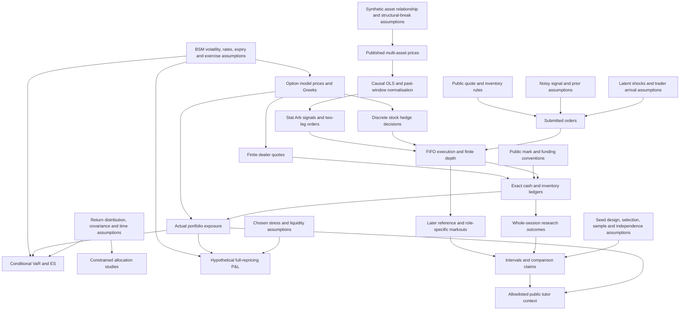

# Model-risk dependency map

Read arrows as “this assumption affects these outputs,” not proof that the output predicts reality. The central [assumptions register](../../ASSUMPTIONS.md) defines each model's scope.

An accounting identity can hold perfectly while the model feeding the mark or risk forecast is wrong. For example, the cash paid for an option is exact; tomorrow's option value under fixed IV is conditional. Likewise a reproducible Stat Arb backtest can be causally correct and still fail when its fitted relationship changes.
